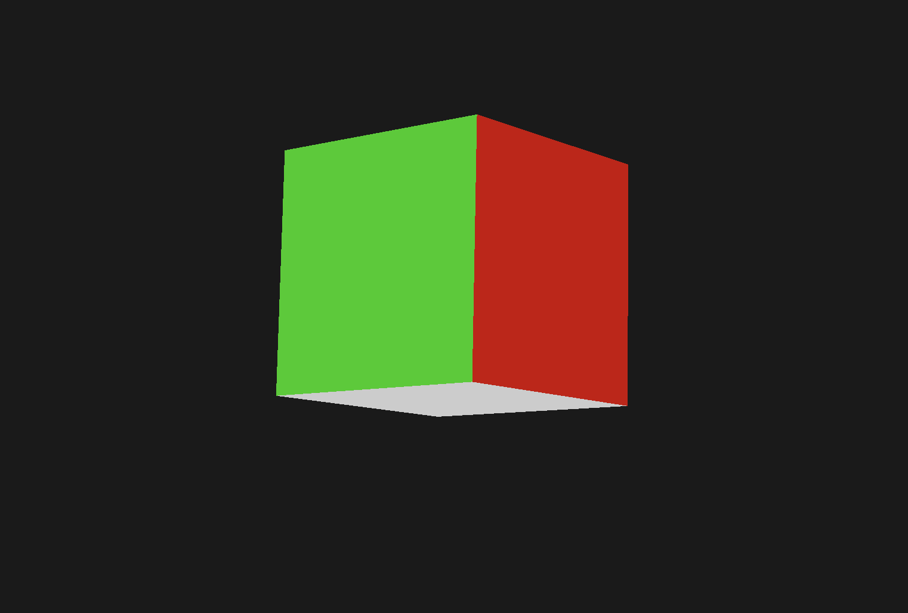

# Model Loader (metal-cpp)

A lightweight **3D model loader and renderer** built with [metal-cpp](https://developer.apple.com/metal/cpp/), Apple’s C++ interface for the Metal graphics API.  
This is my first graphics engineering project — aimed at learning modern rendering pipelines while keeping everything in pure C++.

---

## ✨ Features
- Written entirely in **C++20** with [metal-cpp](https://developer.apple.com/metal/cpp/) (no Objective-C required).
- Loads and renders 3D models with vertex data and basic materials.
- Implements a clean separation of concerns:  
  - `Window` – window/context creation (GLFW-backed).  
  - `Renderer` – manages pipelines, command encoding, and drawing.  
  - `Model` – loads and stores mesh data.  
  - `Camera` – view & projection handling.  
  - `Transform` – reusable math for positions, rotations, scaling.
- Extensible design — built so you can plug in more features like lighting, animations, or instancing.

---

## 🖥️ Demo
| Cube Example | 
|--------------|
|  |

| Fox Example |
|--------------|
|  |

---

## 🚀 Getting Started

### Prerequisites
- macOS 14+ with Xcode Command Line Tools
- [CMake](https://cmake.org/download/) 3.15+
- [GLFW](https://www.glfw.org/) (installed via Homebrew or vcpkg)
- A Metal-capable GPU (Apple Silicon or AMD/Nvidia on macOS)

### Build Instructions
```bash
git clone https://github.com/hchalin/Model-loader.git
cd Model-loader
mkdir build && cd build
cmake ..
make -j4
./Model_Viewer
